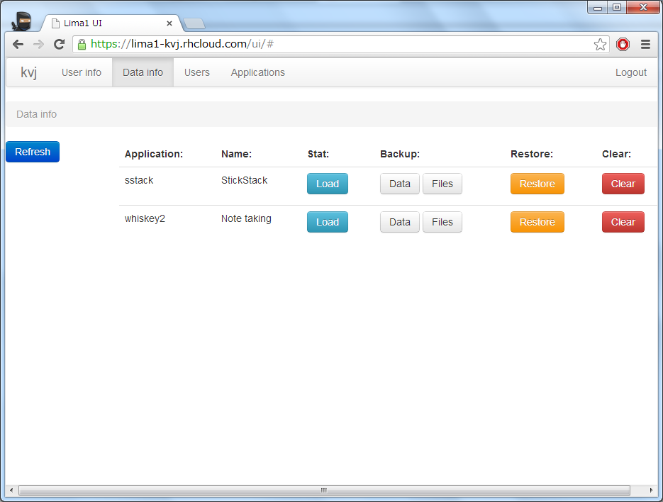
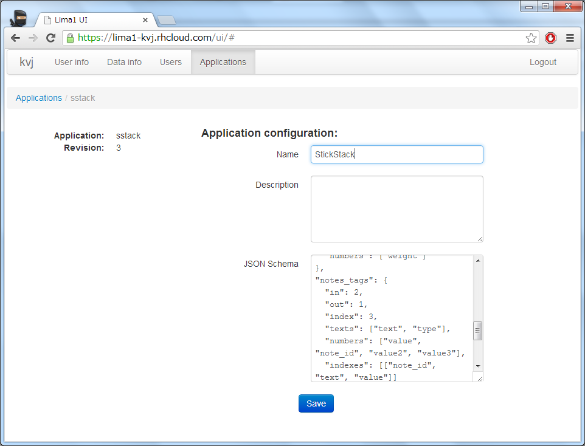

## Lima1OpenShift - Implementation of Sync Service for Lima1 ##

### Main features
* Built with Java, Servlets, PostreSQL, Twitter Bootstrap, CoffeeScript
* Provides API for [Lima1](https://github.com/kvj/Lima1) client libraries via REST and OAuth2
* Runs on RedHat OpenShift free tier

### Administration UI
* Application management (create, edit, upgrade schema)
* User and OAuth2 token management
* Data management (View statictics, backup, restore, cleanup)
* Available at [https://lima1-kvj.rhcloud.com/ui/](https://lima1-kvj.rhcloud.com/ui/)
  * Test username: test00
  * Test password: test00

### UI Screenshots:

